Hi, I'm Steve. I like coffee.

My code is in .NET 6! See the [contributors list](https://dotnet.microsoft.com/en-us/thanks/v6.0.0-rc.1).

| Languages | Platforms | Backend
| --------- | --------- | ------
|  |  | 

### 🎛 Metrics

